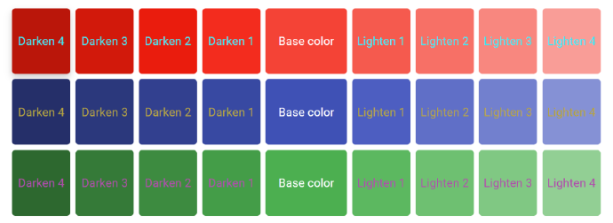
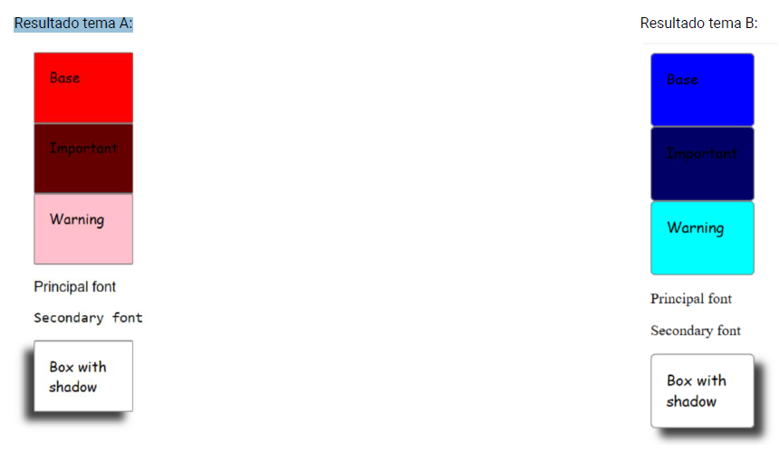
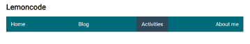
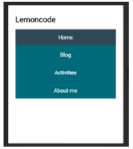
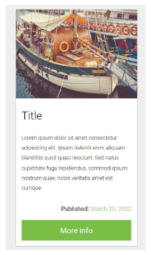

# Master Front End XIV - Módulo 1 - Layout - Básico

## Ejercicio 1

Crear una paleta de colores dinámica.

- Usar el lenguaje SASS para crear distintos temas de paletas de colores.

- La idea es partir de un color base, y a partir de ese color generar 4 colores más oscuros de manera gradual, y cuatro colores más claros de manera gradual.

- Para comprobar que todo esta funcionando como se espera utilizar el siguiente html.

```bash
  <div class="container-1">
    <div class="box darken-4">
      <span class="color-box-text">Darken 4</span>
    </div>
    <div class="box darken-3">
      <span class="color-box-text">Darken 3</span>
    </div>
    <div class="box darken-2">
      <span class="color-box-text">Darken 2</span>
    </div>
    <div class="box darken-1">
      <span class="color-box-text">Darken 1</span>
    </div>
    <div class="box base-color">
      <span class="color-box-text">Base color</span>
    </div>
    <div class="box lighten-1">
      <span class="color-box-text">Lighten 1</span>
    </div>
    <div class="box lighten-2">
      <span class="color-box-text">Lighten 2</span>
    </div>
    <div class="box lighten-3">
      <span class="color-box-text">Lighten 3</span>
    </div>
    <div class="box lighten-4">
      <span class="color-box-text">Lighten 4</span>
    </div>
  </div>
```

NOTA: Para este ejercicio se puede utilizar cualquier estructura de Sass que se considere necesaria. El html para mostrar resultados deberá ser modificado con clases.

Resultado esperado:



## Ejercicio 2

Crear dos temas distintos y mostrar los resultados en una página.

Los cambios en el tema afectan a las siguientes características:

- Color

- Fuente

- Border radius

- Shadow box

Para visualizar los cambios debería ser suficiente importar un tema u otro en el fichero de estilos principal.

Resultado esperado:



## Ejercicio 3

Crear la barra de navegación de la imagen usando flexbox.

- El html es abierto completamente, es decir crear las estructuras necesarias que se crean convenientes.

- La barra de navegación responde a distintas resoluciones. Utilizar media queries para conseguir este resultado.

Resultado esperado para resoluciones mayores:



Resultado esperado para resoluciones menores: 



## Ejercicio 4

Crearemos un elemento de tipo card con Grid CSS.

Las alineaciones deberán hacerse con esta característica, pero el html es totalmente abierto.

Resultado esperado:

 

## Visualización

Si se desea visualizar cada ejercicio, descargarse/clonarse cada carpeta dentro de **layout_basico** y ejecutar los siguientes comandos (previa instalación de [Node.js](https://nodejs.org/es/download/)):

```bash
$ npm install
```

```bash
$ npx parcel src/index.html
```
