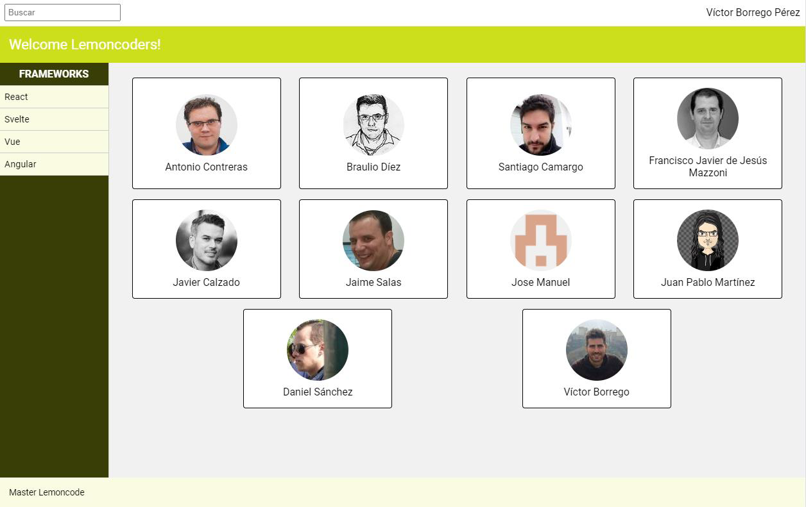
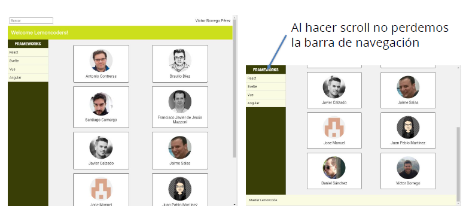
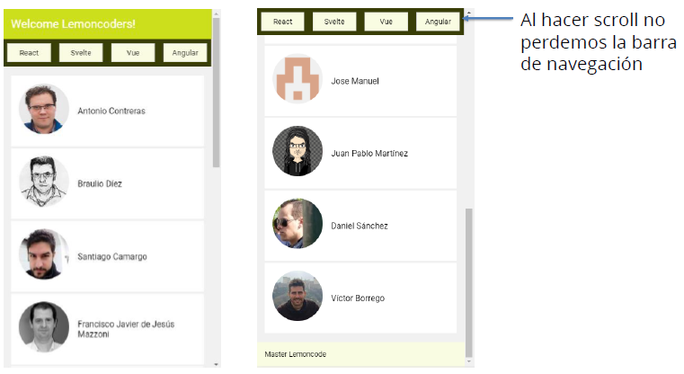

# Master Front End XIV - Módulo 1 - Layout - Extra

## Laboratorio EXTRA

Este laboratorio es EXTRA, y por tanto opcional, pero nuestro consejo es que los cubras todos.


### Introducción

Vamos a crear un Layout para una aplicación, que contendrá:

- Header
- Toolbar con un input de texto para búsquedas y nombre del usuario logado
- Barra con el nombre de la aplicación
- Nav
- Menú con varias opciones de navegación
- Main
- Contenido con la información principal de la aplicación
- Fondo diferente de blanco
- Footer
- Texto de la compañía, al final de la página (aunque el contenido no ocupe todo el alto)

### Diseño Desktop (a partir de 768px)



Comportamiento de la web



### Diseño Mobile/Tablet (hasta 768px de ancho)



### Consideraciones

- No perder en ninguna resolución la barra de navegación al hacer scroll
- En resoluciones pequeñas (hasta 768px de ancho):
  - Contenido a ocultar:
    - Barra superior con input de búsqueda y nombre de usuario
    - Título del menú
  - Cambiar menú a la parte superior, bajo el header
  - Cambiar la organización del contenido principal para visualizarlo sin problema sin problemas

## Visualización

Si se desea visualizar este ejercicio, descargarse/clonarse la carpeta **layout_extra** y ejecutar los siguientes comandos (previa instalación de [Node.js](https://nodejs.org/es/download/)):

```bash
$ npm install
```

```bash
$ npx parcel src/index.html
```
