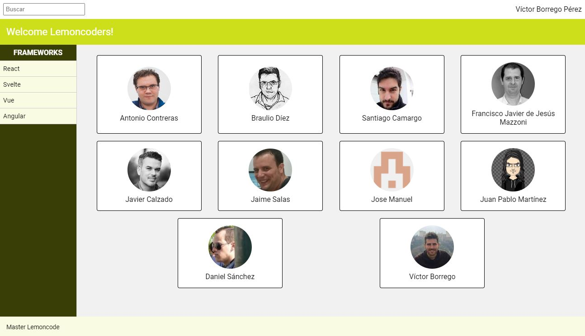

# Master Front End XIV - Modulo 1 - Layout - Extra

## Laboratorio EXTRA

Este laboratorio es EXTRA, y por tanto opcional, pero nuestro consejo es que los cubras todos.



Para ver el enunciado completo revisar [este pdf](<07 - Modulo 1 Layout - Laboratorio Extra.pdf>)

## Visualización

Si se desea visualizar este ejercico, descargarse/clonarse la carpeta **layout_extra** y ejecutar los siguientes siguiente comandos (previa instalación de [Node.js](https://nodejs.org/es/download/)):

```bash
$ npm install
```

```bash
$ npx parcel src/index.html
```
