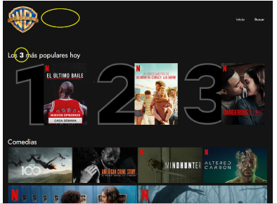

# Master Front End XIV - Módulo 1 - Layout - Reto

## ¡CHALLENGE!

Este reto es opcional, nuestro consejo es que los cubras todos.

### Introducción

Una conocida casa cinematográfica quiere crear su propia plataforma online
para servir sus producciones, a la que van a llamar **_WARNER LIVE_**.

Nos han solicitado una prueba de maquetación de un primer diseño,
del resultado de la prueba dependerá pasar a la siguiente fase de selección.

### Diseño Desktop (ancho 1280px mínimo)


#### Comportamiento esperado


### Diseño responsive


### Diseño Mobile/Tablet (hasta 1280px)




### Notas

- Fuente utilizada: [Jost](https://fonts.google.com/specimen/Jost?preview.text=warner+live&preview.text_type=custom)

- Color de fondo de la plataforma: **_#141414_**
- Se adjunta [carpeta de trabajo](readme_assets/04-playground-ejercicio-laboratorio-avanzado.zip) con la base de HTML (puede ser modificado al gusto) y las imágenes, carátulas y logo, que se pueden modificar/añadir
- Se aporta los requisitos de diseño base, con libertad de creatividad

## Visualización

Si se desea visualizar este ejercicio, descargarse/clonarse la carpeta **layout_reto** y ejecutar los siguientes comandos (previa instalación de [Node.js](https://nodejs.org/es/download/)):

```bash
$ npm install
```

```bash
$ npx parcel src/index.html
```
